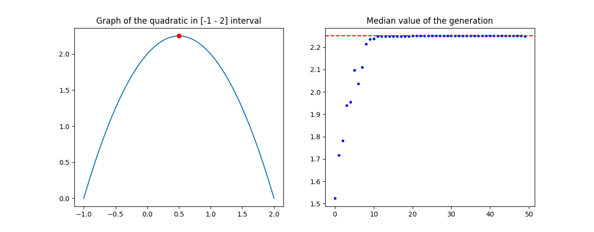
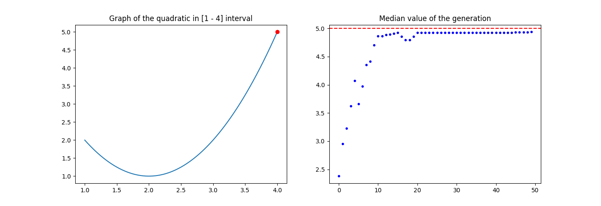

# Genetic algorithm implementation in Python

Python implementation of a genetic algorithm that finds the maximum point of a quadratic function that is positive over a given domain.

## The *input file* has the following layout:

population size (num of chromosomes)

lower bound, upper bound (the domain of the quadratic function)

a, b, c (the parameters of the quadratic function)

precision (for the interval discretization)

crossover probability

mutation probability

number of iterations (stages)

## Example of input file 1

``` python
20
-1 2
-1 1 2
6
0.25
0.01
50
```

## Example of output 1



---

## Example of input file 2

``` python
20
1 4
1 -4 5
6
0.25
0.01
50
```
## Example of output 2



---

This was a project for a university class. One of the requirements was writing more information about process in a file. You can find this [here](https://github.com/ingeaua/Genetic-Algorithms/blob/main/output1.txt) and [here](https://github.com/ingeaua/Genetic-Algorithms/blob/main/output2.txt). 

[Here](https://github.com/ingeaua/Genetic-Algorithms/blob/main/homework%20requirements.pdf) is a pdf with the full description of the project.


